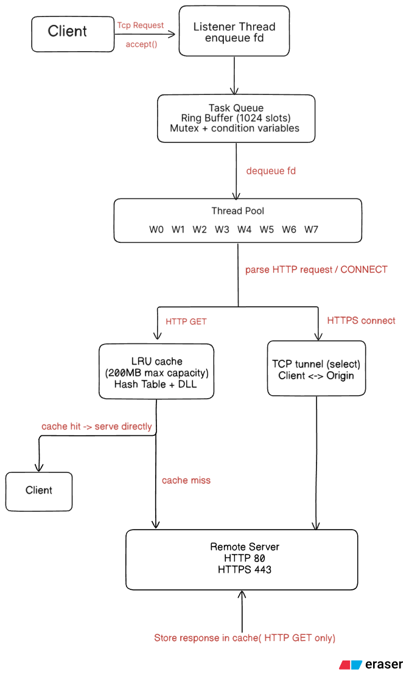
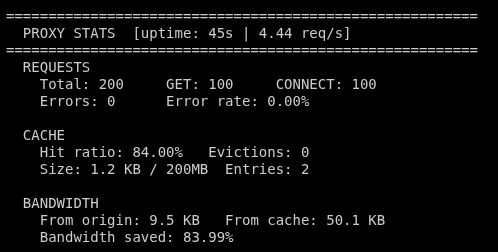
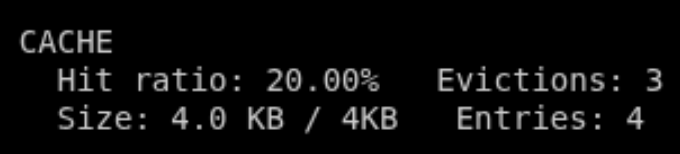

# Multi-Threaded Web Proxy Server with LRU Cache

> A multi threaded proxy server written in C using POSIX sockets and pthreads. The proxy supports HTTP/1.0 and HTTP/1.1 GET requests, HTTPS CONNECT tunneling, thread-safe LRU caching, and real-time performance monitoring.

> HTTP request parsing is based on the ([Parser](https://github.com/vaibhavnaagar/proxy-server))

## Table of Contents

---

1. [Repo Structure](#repo-structure)
2. [Architecture](#architecture)
3. [Features](#features)
4. [Components](#components)
5. [Build & Run](#build&run)
6. [Results](#results)

## Repo Structure

---

```text
proxy_server
│
├── main.c
├── Makefile
├── README.md
│
├── cache
│   ├── cache.c
│   └── cache.h
│
├── client_handler
│   ├── client_handler.c
│   └── client_handler.h
│
├── http
│   ├── http.c
│   └── http.h
│
├── proxy_parse
│   ├── proxy_parse.c
│   └── proxy_parse.h
│
├── server
│   ├── server.c
│   ├── server.h
│   ├── thread_pool.c
│   └── thread_pool.h
│
├── stats
│   ├── stats.c
│   └── stats.h
│
└── tests
    └── stress_test.py
```

## Architecture

---



## Features

---

### Networking

- Supports HTTP/1.0 and HTTP/1.1 GET requests
- Supports HTTPS tunneling via the CONNECT method
- Concurrent handling of multiple clients through a fixed-size worker pool
- Socket-based implementation using POSIX networking APIs

### Concurrency

- Fixed-size thread pool with 8 worker threads
- Producer-consumer architecture using a shared task queue
- Mutex and condition variable synchronization using pthreads
- Thread-safe cache and statistics modules

### LRU Cache

- Thread-safe in-memory LRU cache
- Maximum cache capacity: 200 MB
- O(1) average lookup using a hash table
- Doubly linked list for LRU ordering
- Automatic eviction of least recently used entries
- Cache hit ratio and eviction tracking

### Performance Monitoring

- Real-time request statistics
- GET and CONNECT request counters
- Cache hit ratio tracking
- Bandwidth savings measurement
- Cache occupancy and eviction metrics
- Periodic statistics reporting every 15 seconds

### Reliability

- Tested using AddressSanitizer (ASan)
- Tested using ThreadSanitizer (TSan)
- Concurrent stress testing with Python ThreadPoolExecutor

## Components

---

### Listener Thread

Accepts incoming client connections and pushes sockets into the task queue.

### Thread Pool

8 worker threads consume client sockets and process requests concurrently.

### HTTP Handler

Processes HTTP GET requests and interacts with the cache.

### HTTPS Tunnel

Handles CONNECT requests and forwards encrypted traffic between client and remote server.

### LRU Cache

Hash table + doubly linked list implementation supporting O(1) average lookup and eviction.

### Statistics Module

Tracks request counts, cache performance, bandwidth usage, and error metrics.

## Build & Run

### Build

make

AddressSanitizer build:

make SAN=address

ThreadSanitizer build:

make SAN=thread

### Run

./proxy < port >

Example: ./proxy 8080

### Testing

python3 test/stress_test.py

## Results

---

### 1. Concurrent HTTP & HTTPS Workload

Tested with 2 http and 2 https servers 50 times each


### 2. LRU Eviction Validation

Reduced max cache size to check lru eviction

